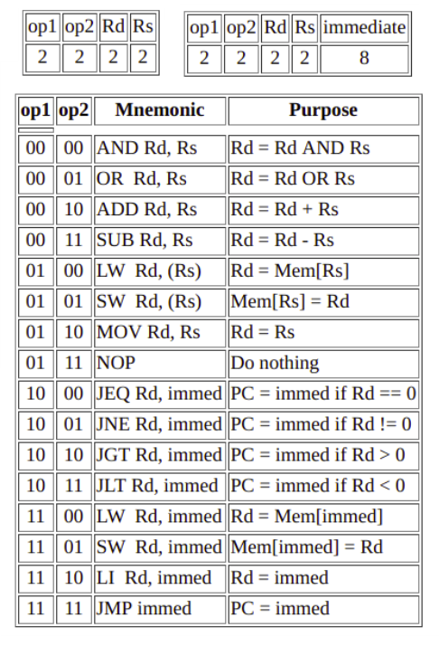

## 8-Bit Von Neumann Architecture CPU

#### Contributors 
- Praveen Kumar Gupta
- Durvesh Bhalekar

### Abstract
> This verilog program shows the simulation of a 8-bit processor built on the principles of the Von Neumman architecture.
> The program can be loaded in the RAM module and the following code carries out the instructions accordingly. 

### Functionalities   
> This processor allows supported instructions (as given in the Instruction Set file)  to be written in the RAM module.
> An Instruction cycle is broken into 3 phases - Fetch , Decode and Execute
> Instructions from RAM Module are fetched into the Instruction Register on the appropriate phase, it is decoded by the control unit which sets various flags and select lines depending on the type of instruction, like 
> * fetching into immediate register
> * writing in register file
> * changing PC value
> * selecting address from imm. or PC
> * selecting the correct register from RF
> * Deciding the ALU operation
> * Sending the ALU output to the required place.

## Software Requirements

- Logisim
- iverilog
- gtkwave

## Usage Instructions

* Open either Behavioural or Dataflow Modelling Verilog file for CPU.

* From the given Instruction Set table, write 8-Bit binary instructions
  in the given RAM module at the end of the file.
* Sample instructions are already present. Overwrite it if needed.

* Enable Simulation.
  
  In terminal,

  Compile the file as (Without `)
        ` iverilog VerilogBM-210-235.v Verilog-210-235.v -o Verilog-210-235.vvp `
  Run the vvp file as (Without `)
        ` vvp Verilog-210-235.vvp ` 
  Open the output wave as(Without `)
        ` gtkwave VerilogBM-210-235.vcd `

Corresponding changes can be seen in the wave as per instructions.

## References
- Computer Organization and Design - Book by David Patterson and John Hennessy
- [Computer Architechture Tutorials](http://minnie.tuhs.org/CompArch/Tutes/week03.html)
